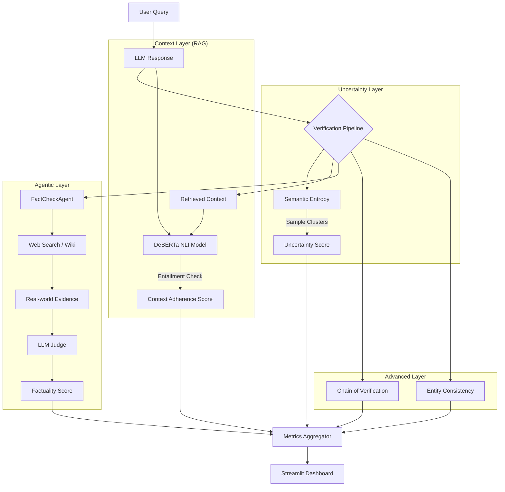

# Hallucination Rate Detection System (2026)

A production-grade system to detect, quantify, and monitor the hallucination rate of LLMs using state-of-the-art techniques including **Semantic Entropy**, **RAG Entailment**, and **Chain of Verification (CoVe)**.


## 🏗️ System Architecture

The system operates as a multi-stage pipeline to verify every LLM response.



## 🚀 Features

### 1. Semantic Uncertainty (White-box/Black-box)

- **Technique**: Detects confabulations by sampling multiple responses and clustering them by meaning.
- **Metric**: High entropy in semantic space = High likelihood of hallucination.

### 2. RAG Context Adherence

- **Technique**: Uses a Natural Language Inference (NLI) model (`microsoft/deberta-v3-large`) to check if response claims are logically entailed by the retrieved context chunks.
- **Goal**: Prevent "faithful hallucinations" (where the model answers correctly but not from the provided source).

### 3. Agentic Verification

- **Technique**: `FactCheckAgent` autonomously generates search queries (DuckDuckGo/Wikipedia) to verify atomic claims against real-world data.
- **Workflow**: Claim Extraction -> Search -> Evidence Retrieval -> Verdict (True/False/Uncertain).

### 4. Advanced Logical Checks (Phase 5)

- **Chain of Verification (CoVe)**: The model generates its own verification questions to spot internal inconsistencies.
- **Entity Consistency**: Monitors Named Entities (NER) across stochastic samples to detect specific entity hallucinations (e.g., changing dates or names).

## 🛠️ Setup

1.  **Clone & Environment**:

    ```bash
    git clone https://github.com/your-repo/hallucination-detection.git
    cd hallucination-detection
    python3 -m venv venv
    source venv/bin/activate
    ```

2.  **Install Dependencies**:
    ```bash
    pip install -r requirements.txt
    python -m spacy download en_core_web_sm
    ```

## 💻 Usage

### Quick Start

Run the dashboard to see the system in action with mock data:

```bash
streamlit run dashboard.py
```

### Library Usage

#### RAG Verification

```python
from hallucination.rag_verifier import RAGVerifier

verifier = RAGVerifier()
# Returns 0.0 (Perfect) to 1.0 (Hallucinated)
score = verifier.verify_context(
    response="Paris is the capital of France.",
    context="France's capital is Paris."
)
```

#### Fact Checking

```python
from hallucination.fact_check_agent import FactCheckAgent

agent = FactCheckAgent()
report = agent.fact_check("Elon Musk acquired Twitter in 2022.")
print(f"Verified Claims: {report.verified_claims}/{report.total_claims}")
```

#### Advanced Verification (CoVe)

```python
from hallucination.advanced import AdvancedVerifier

verifier = AdvancedVerifier(llm_fn=my_llm_function)
result = verifier.chain_of_verification(
    prompt="Who is CEO of Google?",
    response="Sundar Pichai"
)
print(f"Consistency Score: {result.consistency_score}")
```

## 📊 Dashboard

The Streamlit dashboard allows real-time monitoring of your application's health.

- **Hallucination Rate**: Aggregate view of all failure modes.
- **Failure Taxonomy**: Breakdown by RAG failures, Logic errors, and Factuality errors.

## 🤝 Contributing

Contributions are welcome! Please read `hallucination_master_plan.md` to understand the roadmap.
